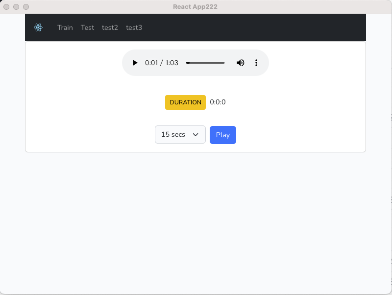

### electron + react practice 



### Installation
```shell
cd bird;

npm install
npm run build
npm run mix
npm run make #it will build packages in out directory
```
### Dev Command
```shell
npm run start #open react  web in browser
npm run starte #open electron app

```


### Thank below websites

# solve how build electron + react
#### https://blog.csdn.net/weixin_38080573/article/details/105113219

# solve how workflow configuration
#### https://dev.to/erikhofer/build-and-publish-a-multi-platform-electron-app-on-github-3lnd

# solve workflow environment veriable
#### https://cloud.tencent.com/developer/ask/sof/1025925

